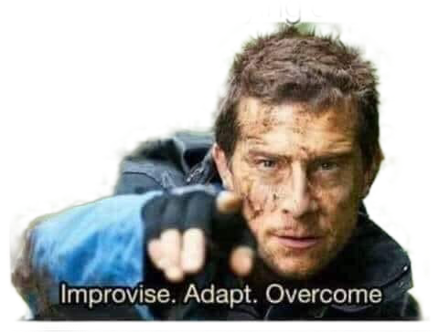

# Project Kratzau

Alternative name: Escape from Kovák

## Warning:

The story is purely fictional. Any resemblance to actual persons, living or dead, is entirely coincidental.

## Description:

The purpose of the game is to escape from ex-hostel in Kratzau called Kovák. You are poor homeless boi trying to survive in horrible conditions of this wasteland.

Evil capitalistic mayor of the town wants to burry your sweet and warm home into sand! You have to escape!

## Design:

You have time limit to escape from Kovák building. There are lots of items, that may help you escape.

Game includes:
* Different puzzle rooms
* Quick-time events
* Time limit
* Environment interactions

## Authors:

Martin Bulíř
Petr Novák